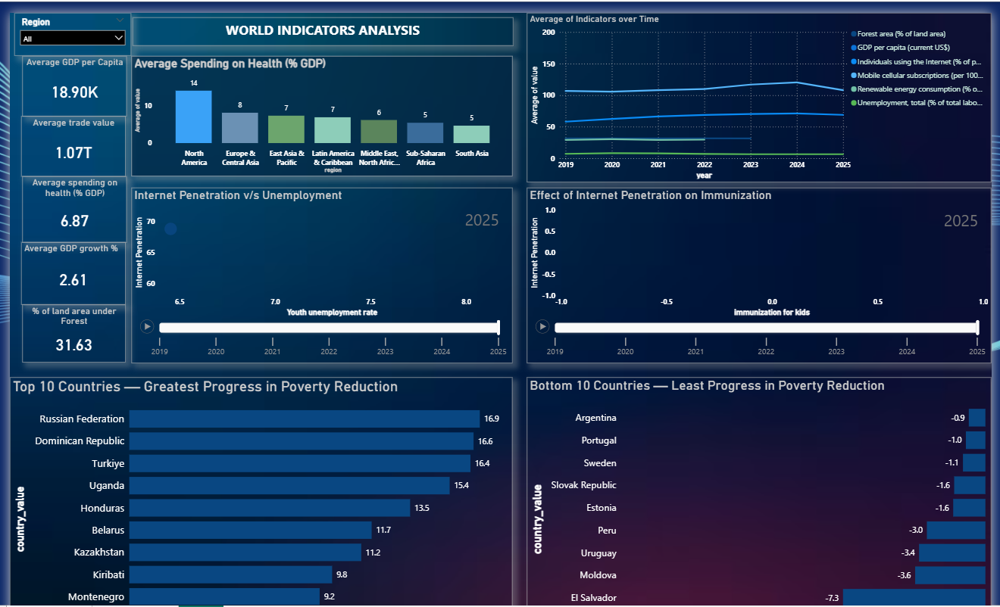
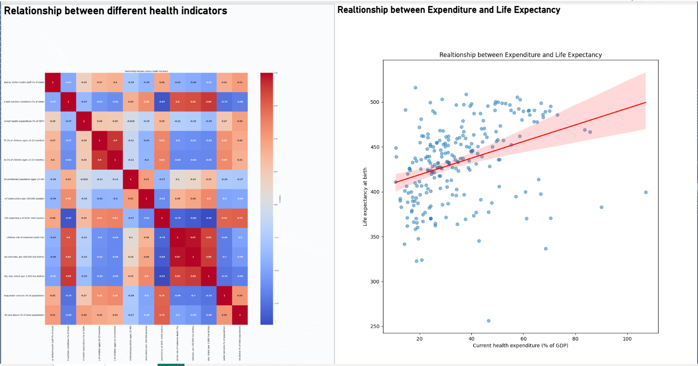

# 🌍 Live Global Indicators Dashboard — Python & Power BI

A live, auto-refreshing dashboard that tracks global economic, health, environmental, and social indicators — built by connecting a **Python data pipeline** directly to **Power BI**, using **real-time data from the World Bank API**.



---

## 📌 Project Overview

Most dashboards go stale the moment someone forgets to re-download the data. This project solves that by building a **live connection** between a public API and Power BI:

- A Python script automatically fetches the latest global indicators — GDP, health spending, poverty, unemployment, internet access, and more — directly from the **World Bank API**.
- The script cleans and organizes this data, and feeds it into Power BI through a live connection.
- Whenever new data is published by the World Bank, the **Power BI dashboard refreshes automatically** — no manual downloads, no manual updates.
- The dashboard turns raw statistics into clear, interactive visuals so trends across countries and regions are easy to explore.

The goal wasn't just to build a dashboard — it was to answer a specific set of real-world development and economic questions (listed below) using this live data.

---

## 🛠️ Tech Stack

| Layer | Tools |
|---|---|
| Data extraction | Python, `requests` |
| Data processing | `pandas`, `numpy` |
| Reliability | `tenacity` (retry logic for API calls) |
| Custom visuals | `seaborn`, `matplotlib` (run inside Power BI) |
| Dashboard / BI | Power BI (live refresh) |
| Data source | World Bank Open Data API |

---

## ⚙️ How It Works

**1. Fetch country reference data**
Pulls metadata for all countries from the World Bank API — region, income level, and lending type — and cleans nested JSON fields (e.g. `region`, `incomeLevel`) into flat, usable columns.

**2. Fetch the full indicator catalog**
The World Bank exposes 15,000+ indicators. The script pages through the entire indicator catalog (500+ pages) to build a master reference list.

**3. Select and group relevant indicators**
Instead of pulling everything, indicators are organized into 8 meaningful categories relevant to the analysis:
- Economic activity & growth (GDP growth, GDP per capita)
- Labour market (unemployment, youth unemployment, labour force)
- Trade & globalization (exports, imports)
- Poverty & inequality (poverty headcount, Gini index)
- Environment (renewable energy use, forest area)
- Health (life expectancy, infant mortality, immunization, health expenditure, and more)
- Technology (internet usage, mobile subscriptions)

**4. Extract indicator data with pagination**
For each indicator, the script loops through all result pages from the API, flattens the nested JSON response using `pandas.json_normalize`, and filters records to recent years (post-2018) to keep the analysis current.

**5. Merge with country reference data**
Each category's indicator data is merged with the country metadata (region, income level) — enabling regional and economic-tier comparisons later in the dashboard.

**6. Export & connect to Power BI**
Cleaned datasets are exported and connected to Power BI, where the live refresh keeps the dashboard synced with the latest World Bank data.

**7. Advanced visuals via Python-in-Power BI**
Two visuals go beyond what Power BI's native charts can do, built directly with Python scripts inside Power BI:
- A **correlation heatmap** of health indicators (health expenditure, life expectancy, immunization, mortality, disease burden) using a pivot table + `.corr()` + `seaborn.heatmap`.
- A **regression scatter plot** of health expenditure (% of GDP) vs. life expectancy, using `seaborn.regplot` with a fitted trend line.

---

## ❓ Business Questions This Dashboard Answers

1. What is the average GDP per capita, trade value, health spending (% of GDP), and GDP growth rate across countries?
2. What proportion of land area is forest, and how does that vary?
3. How does health spending (% of GDP) compare across world regions?
4. How have key indicators — forest area, mobile/internet subscriptions, GDP, renewable energy, unemployment — changed over time?
5. Does higher internet penetration relate to higher immunization rates?
6. Does expanding internet access help reduce unemployment?
7. Which 10 countries have made the *least* progress in poverty reduction?
8. Which 10 countries have made the *most* progress in poverty reduction?
9. How do health indicators (expenditure, life expectancy, immunization, child mortality, disease burden) relate to one another?
10. Does higher health expenditure actually drive improvements in life expectancy?

---

## 📊 Key Insights

- **Health spending vs. life expectancy**: There is a clear positive relationship — countries that spend a higher % of GDP on health tend to have longer life expectancy, though the relationship isn't perfectly linear, suggesting other factors (like healthcare access and quality) also matter.
- **Regional health spending gap**: North America spends the highest share of GDP on health (~14%), while South Asia spends the least (~5%) — highlighting a significant regional disparity in health investment priorities.
- **Poverty reduction leaders**: Russian Federation, Dominican Republic, and Turkiye showed the strongest progress in reducing poverty.
- **Poverty reduction laggards**: El Salvador, Moldova, and Uruguay showed the least progress — flagging where policy attention may be most needed.
- **Health indicator relationships**: Immunization rates, child mortality, and life expectancy are strongly correlated — reinforcing that immunization and basic healthcare access are closely tied to overall population health outcomes.
- **Internet penetration**: Higher internet access shows a positive association with immunization awareness and a negative association with youth unemployment, suggesting digital connectivity plays a role in both public health engagement and economic opportunity.



---

## 📁 Repo Structure

```
├── data_pipeline.py       # Full ETL: fetch, clean, merge, export World Bank data             
├── requirements.txt       # Correlation heatmap + regression scatter plot (Python-in-Power BI)
├── screenshots/           
│   ├── dashboard_overview.png
│   └── health_insights.png
└── README.md
```

---

## 🚀 Getting Started

```bash
pip install -r requirements.txt
python data_pipeline.py
```

This fetches and exports cleaned CSVs (`economic.csv`, `health.csv`, `poverty.csv`, etc.), which can be loaded into Power BI and connected for live refresh.

---

## 🔮 Possible Improvements

- Wrap API calls with `tenacity` retry logic to handle transient failures more gracefully.
- Automate scheduled refresh directly through the Power BI service.
- Expand indicator coverage (education, gender, climate).
- Publish the dashboard via Power BI's "Publish to Web" for a public, interactive link.

---

## 📎 Data Source

All data is sourced from the [World Bank Open Data API](https://publicapi.dev/world-bank-api) — a free, public API of global development indicators.
